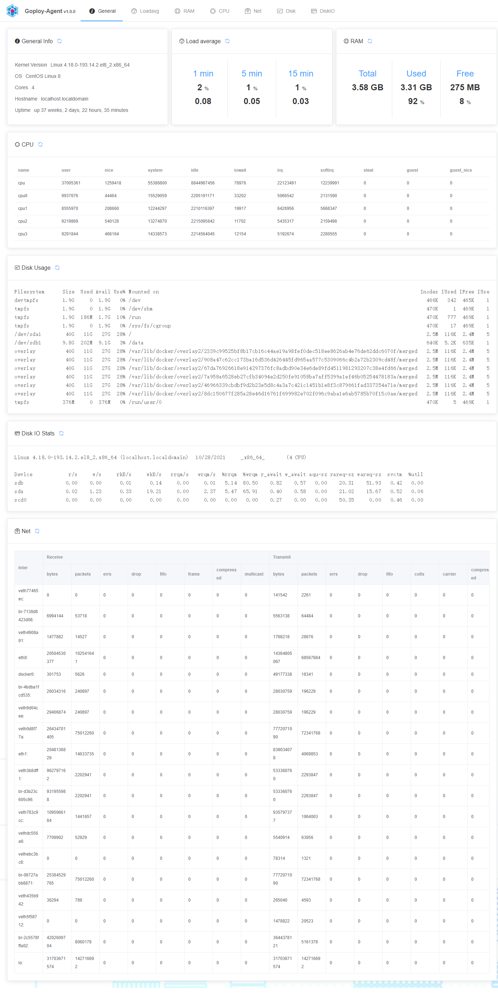

# goploy-agent
An open-source and monitoring agent.

## Background
I need an agent to monitor my server, that it.

## Install
1. Download the latest release

## Use
1. Run ./goploy-agent or goploy-agent.exe or goploy-agent.mac
2. Follow the installation guide
3. web http://ip:port

## Preview

## Contribute

[Issue](https://github.com/zhenorzz/goploy-agent/issues/new) 

## License

[MIT](LICENSE) © zhenorzz